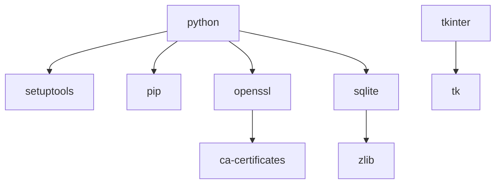

以下是 Conda 在安装 Python 3.12 时自动安装的每个依赖包的详细解释，按功能分类说明：

---

### **1. Python 核心组件**
| 包名 | 版本 | 作用 |
|------|------|------|
| **python** | 3.12.11 | Python 解释器本体 |
| **setuptools** | 78.1.1 | 包管理工具（用于安装/构建Python包） |
| **pip** | 25.1 | Python 包安装工具 |
| **wheel** | 0.45.1 | `.whl` 格式包的支持工具 |

---

### **2. 加密/安全相关**
| 包名 | 版本 | 作用 |
|------|------|------|
| **openssl** | 3.0.16 | 提供 HTTPS/SSL 加密支持（如 `urllib.request` 访问网页） |
| **ca-certificates** | 2025.2.25 | 根证书库（验证网站SSL证书合法性） |
| **libffi** | 3.4.4 | 外部函数接口（支持调用C库） |

---

### **3. 数据库支持**
| 包名 | 版本 | 作用 |
|------|------|------|
| **sqlite** | 3.45.3 | 轻量级数据库引擎（Python标准库 `sqlite3` 模块依赖） |

---

### **4. 压缩/编码支持**
| 包名 | 版本 | 作用 |
|------|------|------|
| **bzip2** | 1.0.8 | `bz2` 压缩支持（如 `import bz2`） |
| **xz** | 5.6.4 | LZMA 压缩算法支持 |
| **zlib** | 1.2.13 | `gzip` 压缩支持（如 `import gzip`） |

---

### **5. 系统运行时**
| 包名 | 版本 | 作用 |
|------|------|------|
| **vc** | 14.42 | Visual C++ 运行时（Windows编译工具链） |
| **vs2015_runtime** | 14.42.34433 | Visual Studio 2015 运行时库 |
| **expat** | 2.7.1 | XML 解析库（`xml.parsers.expat` 依赖） |

---

### **6. 图形界面支持**
| 包名 | 版本 | 作用 |
|------|------|------|
| **tk** | 8.6.14 | GUI 工具包（`tkinter` 模块依赖） |

---

### **7. 时区数据**
| 包名 | 版本 | 作用 |
|------|------|------|
| **tzdata** | 2025b | 时区数据库（`datetime` 模块依赖） |

---

### **关键依赖关系图解**


---

### **常见问题解答**
**Q1: 为什么需要安装 Visual Studio 运行时？**  
A1: Windows 版 Python 是用 VC++ 编译的，需要对应运行时库才能执行编译后的二进制文件。

**Q2: 可以删除 `tk` 包节省空间吗？**  
A2: 可以，但会导致 `import tkinter` 失败（不影响大多数机器学习用途）：
```bash
conda remove --force tk
```

**Q3: `tzdata` 为什么需要更新？**  
A3: 时区规则会变化（如夏令时调整），更新包可保证 `datetime.now()` 等函数返回正确时间。

---

### **总结建议**
1. **不要随意删除依赖**：特别是 `openssl`、`sqlite` 等核心包
2. **最小化安装需求**：若需极简环境，使用 Docker 基础镜像比 `--no-deps` 更可靠
3. **检查兼容性**：机器学习框架（如 PyTorch）可能需要特定版本的 `openssl` 或 `vc`

需要帮助优化你的具体环境配置吗？可以提供 `conda list` 的完整输出，我可以分析是否存在冗余包。